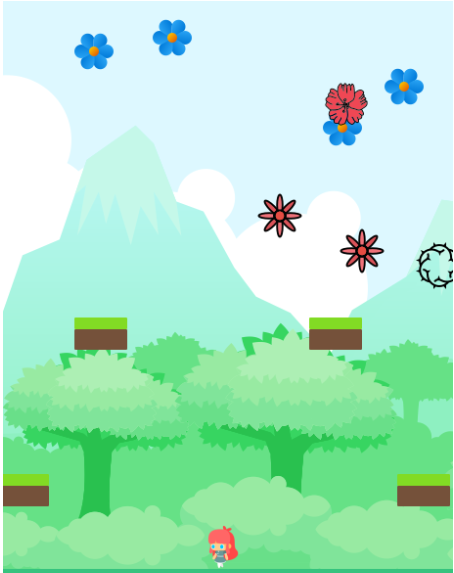

# Pick Flower 🌼



# About this Project - Javascript Capstone

- This project is to build a platform game such as the [endless runner game ](https://www.emanueleferonato.com/tag/endless-runner/), using [Phaser](https://phaser.io/) framework, and implement scoring system.

## Table of Contents

* [What I have done](#what-i-have-done)
* [Built With](#built-with)
* [Live Demo](#live-demo)
* [Game Design Document(GDD)](#game-design-document)
* [Getting Started](#getting-started)
* [Tests](#test)
* [How to run the game](#how-to-run-the-game)
* [What is Pick Flowers](#what-is-pick-flowers)
* [How to play the game](#how-to-play-the-game)
* [Rule of the game](#rule-of-the-game)
* [Author](#author)
* [Contributing](#contributing)
* [Show your support](#show-your-support)
* [License](#license)
* [Acknowledgements](#acknowledgements)

## What I have done 👍

- Planned the game overview and specific mechanic with [Game Design Document(GDD)](./design.md)
- Built platform game with [Phaser library](https://phaser.io/phaser3)
- Implemented a scoring system using the given API to save the score with a username and display it in a game view
- Deployed to a server so the game is accessible for anyone
- Write tests with [Jest](https://jestjs.io/)

Also, these features are added:
- Three modes: Easy, normal, and hard that is different on the speed of showing enemies and fruits
- Double jump: The main character can double jump

## Built With

* [HTML5](https://en.wikipedia.org/wiki/HTML5)
* [CSS](https://en.wikipedia.org/wiki/CSS)
* [JavaScript](https://en.wikipedia.org/wiki/JavaScript)
* [Phaser 3](https://phaser.io/phaser3)

## Live Demo

[Pick Flower](https://pick-flower.netlify.app/)

## Game Design Document(GDD)

[Game Design Document (GDD) Link](./design.md)

## Getting Started

To get a local copy up and running follow these simple example steps.

1. On the project GitHub page, navigate to the main page of the repository.
2. Under the repository name, locate and click on a green button named `Code`. 
3. Copy the project URL as displayed.
4. If you're running the Windows Operating System, open your command prompt. On Linux, Open your terminal. 
5. Change the current working directory to the location where you want the cloned directory to be made. Leave as it is if the current location is where you want the project to be. 
6. Type git clone, and then paste the URL you copied in Step 3. <br>
For this project:

```
git clone https://github.com/AbdumurodovaZulfizar/Pick-Flower.git
```

7. Press Enter. Your local copy will be created.

## Test

1. To run the tests

```
npm test

```

2. To test scpesific file

```
npm test _file_name_

```

[All tests have passed](./src/assets/images/test.PNG)

## How to run the game

```
cd Pick-Flower
```

```
npm install
```

```
npm run build
```

- Then Click `Go Live` at the right-bottom corner of VSCode, and click dist directory (Or simply click right side of mouse on the index.html and select _Open with live server_)


## What is Pick flowers

Pick Flowers is simple game, a cute girl picks flowers from garden, and when she touches thorn the game ends.

## How to play the game

1. Click the "Click to Start" button
2. Input a username that will be shown if a player will be a top 5 scorer.
3. Choose the mode from easy, normal, or hard that is different on the speed of showing spiders(enemy) and fruits
4. Start the game
5. In the game-over view, 
  - To see the top 5 scorers, click the "Score" button.
  - To start the different username or mode, click the "TOP" button
  - To restart the game in the same mode, click the "Restart" button
6. In the score view, 
  - The top 5 scorers are showing with their username and their score
  - To start the different username or mode, click the "TOP" button
  - To restart the game in the same mode, click the "Restart" button

## Rule of the game

- A player gets a **70** scores when touching a flower
- The game will be over when a player touches a thorn
- A player can be operated by using keyboard cursors arrows (&larr;, &rarr;, &uarr;). 
- To run to the left, click **&larr;**, to the right, click **&rarr;**, and to jump up, click **&uarr;**
- A player can double jump, to do it, click **&uarr; again** in the air

## Author

🏻‍💼 **Zulfizar Abdumurodova**

- GitHub: [Abdumurodova Zulfizar](https://github.com/AbdumurodovaZulfizar) 
- Twitter: [Abdumurodova Zulfizar](https://twitter.com/Zulfiza70357085)
- LinkedIn: [Abdumurodova Zulfizar](https://www.linkedin.com/in/zulfizar-abdumurodova-a61527206/) 

## Contributing

Contributions, issues, and feature requests are welcome!
Feel free to check the [issues page](../../issues).

1. Fork the Project
2. Create your Feature Branch (`git checkout -b feature/AmazingFeature`)
3. Commit your Changes (`git commit -m 'Add some AmazingFeature'`)
4. Push to the Branch (`git push origin feature/AmazingFeature`)
5. Open a Pull Request

## Show your support

Give a ⭐️ if you like this project!


## License

This project is [MIT](./LICENSE) licensed.


## Acknowledgements
* [Phaser3](https://phaser.io/phaser3)
* [axios](https://github.com/axios/axios)
* [Illustration by Icons 8](https://icons8.com/)
* [Game Art 2D](https://www.gameart2d.com/freebies.html)
* [Microverse](https://www.microverse.org/)
